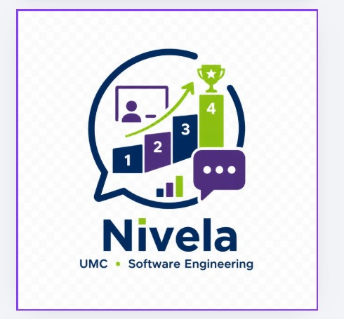

<div align="center">

  

  # 🎓 Nivela
  ### Plataforma Web de Nivelamento e Aprendizagem Gamificada

  [](https://www.djangoproject.com/)
  [](https://www.python.org/)
  [](https://www.postgresql.org/)
  [](./LICENSE)
  [](https://nivela-cw5t.onrender.com)

  <br>

  🌐 **[Acessar Aplicação Publicada (nivela-cw5t.onrender.com)](https://nivela-cw5t.onrender.com)**

</div>

---

> ℹ️ **Nota de Hospedagem:** A aplicação está hospedada no plano gratuito do Render. Caso a instância esteja em repouso por inatividade, a primeira requisição pode levar cerca de 50 segundos.

---

## 📖 Sobre o Projeto

O **Nivela** é uma plataforma web desenvolvida como **Projeto Integrador do curso de Engenharia de Software da Universidade Mogi das Cruzes (UMC)**.

A proposta combina mecanismos de engajamento inspirados no *Duolingo* (trilhas de aprendizado sequenciais, acúmulo de XP, cálculo de *streak* e monitoramento de habilidades) com a dinâmica colaborativa de salas de aula virtuais estilo *Microsoft Teams* (gestão de turmas, chat interativo em tempo real e mural de avisos).

---

## 🛠️ Tecnologias Utilizadas

| Categoria | Tecnologia |
| :--- | :--- |
| **Back-end** | Python 3.11+, Django 5.0+ (Arquitetura MVT) |
| **Banco de Dados** | PostgreSQL |
| **Front-end** | HTML5, CSS3 (Bootstrap 5), JavaScript (Vanilla JS) |
| **Segurança** | `django-two-factor-auth` (2FA TOTP), `django-axes` (Proteção Brute Force), Fernet (AES-128) |
| **Hospedagem** | Render |

---

## 🏛️ Arquitetura do Sistema

O projeto adota a arquitetura modular **MVT (Model-View-Template)** do Django:

```text
Projeto_Nivela/
├── core/                   # Configurações globais, rotas e middlewares de segurança
├── usuarios/               # Contas, perfis, controle de acesso e autenticação nativa
├── lgpd/                   # Privacidade, consentimento, exportação (portabilidade) e exclusão
├── turmas/                 # Salas de aula virtuais, fóruns de avisos e alunos
├── chat/                   # Módulo de comunicação interativa e mensagens
├── gamificacao/            # Trilhas de aprendizado, XP, streaks e exercícios
├── nivelamento/            # Avaliação diagnóstica e análise de habilidades
├── static/                 # Arquivos estáticos globais (css/, js/, img/)
├── templates/              # Layouts base e componentes Bootstrap globais
└── docs/                   # Documentação técnica, diagramas e relatórios acadêmicos
```

## 🔒 Segurança e Privacidade (**Privacy & Security by Design**)

A arquitetura do Nivela foi projetada sob o princípio de **Default Deny** (Negação por Padrão), onde todas as rotas exigem autenticação prévia por padrão.

| Mecanismo | Descrição / Implementação |
| :--- | :--- |
| **Autenticação em Dois Fatores (2FA)** | Suporte nativo a TOTP via `django-two-factor-auth`. |
| **Proteção contra Força Bruta** | Monitoramento e bloqueio temporário de IP/usuário por tentativas falhas com `django-axes`. |
| **Criptografia de Dados Sensíveis** | Algoritmo **Fernet (AES-128 em modo CBC)** via biblioteca `cryptography` para campos sensíveis em repouso no banco de dados. |
| **Hash de Senhas** | Algoritmo PBKDF2 com HMAC-SHA256 padrão da W3C/Django. |
| **Conformidade com a LGPD** | • Painel de transparência de dados coletados.<br>• Solicitação de exclusão definitiva de conta (`excluir_conta.html`).<br>• Portabilidade e download de dados do usuário (`meus_dados.html`). |

---

## 💻 Como Executar o Projeto Localmente

<details>
<summary><b>▶️ Clique aqui para ver o passo a passo de instalação local</b></summary>

### Pré-requisitos

* **Python 3.11+**
* **PostgreSQL** instalado e rodando
* **Git**

### Passo a Passo

1. **Clonar o repositório:**

   ```bash
   git clone https://github.com/Projeto-Integrador2026/Projeto_Nivela.github.git
   cd Projeto_Nivela.github
   ```

2. **Criar e ativar o ambiente virtual:**

   Windows (PowerShell):

   ```powershell
   python -m venv venv
   .\venv\Scripts\activate
   ```

   Linux/macOS:

   ```bash
   python3 -m venv venv
   source venv/bin/activate
   ```

3. **Instalar as dependências:**

   ```bash
   pip install -r requirements.txt
   ```

4. **Configurar as variáveis de ambiente:**

   Crie um arquivo `.env` na raiz do projeto com o seguinte modelo:

   ```env
   SECRET_KEY=sua_secret_key_de_desenvolvimento
   FIELD_ENCRYPTION_KEY=sua_chave_fernet_aqui
   DB_NAME=nivela_db
   DB_USER=postgres
   DB_PASSWORD=sua_senha_do_postgresql
   DB_HOST=localhost
   DB_PORT=5432
   ```

   Para gerar uma chave Fernet válida:

   ```bash
   python -c "from cryptography.fernet import Fernet; print(Fernet.generate_key().decode())"
   ```

5. **Executar migrações e testes:**

   ```bash
   python manage.py migrate
   python manage.py test
   ```

6. **Iniciar o servidor:**

   ```bash
   python manage.py runserver
   ```

   Acesse em: <http://127.0.0.1:8000/>

</details>

---

## 📚 Documentação Técnica e Acadêmica

Toda a documentação técnica de Engenharia de Software está organizada na pasta [`docs/`](./docs):

| Documento | Descrição |
| :--- | :--- |
| 📋 [Termo de Abertura (TAP)](./docs/TAP) | Escopo, objetivos e alinhamento do projeto |
| 🎯 [Especificação de Requisitos](./docs/Requisitos) | Requisitos Funcionais (RF) e Não Funcionais (RNF) |
| 📐 [Casos de Uso](./docs/Casos-de-Uso) | Diagramas e cenários de utilização |
| 🗄️ [Modelo de Dados (DER)](./docs/DER) | Diagrama Entidade-Relacionamento do banco de dados |
| 🔬 [Documentação Técnico-Científica](./docs/Documentacao-Tecnico-Cientifica) | Decisões arquiteturais e análises de segurança |
| 📊 [Evidências](./docs/Evidencias) | Telas, testes e validação do sistema |
| ✅ [Checklist](./docs/checklist.md) | Acompanhamento de entregáveis do projeto |

---

## 👥 Equipe do Projeto

| Integrante | Função / Responsabilidade |
| :--- | :--- |
| **Beatriz Miguel** | Desenvolvimento Back-end, Front-end e Banco de Dados |
| **Jhonathan Tonello** | Documentação Técnica e Especificações |
| **Vinicius Rodrigues** |  |
| **Prof. Fabiano M.** | Orientação e Avaliação Acadêmica (UMC) |

---

## 📄 Licença

Este projeto é disponibilizado sob a licença **Apache-2.0**. Consulte o arquivo [LICENSE](./LICENSE) para mais detalhes.
