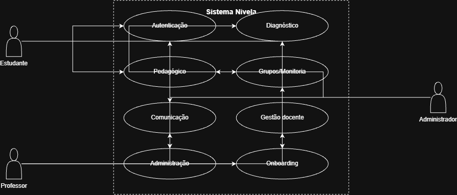

# Diagrama de Casos de Uso — Projeto Nivela

> Documento alinhado ao Termo de Abertura do Projeto (TAP) v1 e aos Requisitos Funcionais e Não Funcionais v2.

## 1. Atores

 Ator - Descrição 

**Estudante** - Usuário que realiza os diagnósticos, acessa trilhas de aprendizagem, participa de grupos/monitorias e se comunica via chat 

**Professor** - Usuário que gerencia turmas, cria atividades/trilhas, acompanha o desempenho da turma e supervisiona monitorias 

**Administrador** - Usuário responsável pela gestão global de usuários, permissões e parametrização da plataforma 

> Controle de acesso baseado em perfis (RBAC), conforme RF03 e RNF06.

## 2. Casos de uso por módulo

### 2.1 Autenticação e Gestão de Perfis
Código - Nome do caso de uso - Ator(es) e Requisito relacionado 

 UC01 - Cadastrar-se na plataforma: Estudante, Professor e Administrador (RF01)
 
 UC02 - Fazer o login: Estudante, Professor e Administrador (RF02)
 
 UC03 - Autenticação com 2FA: Estudante, Professor e Administrador  (RF07, RF08)
 
 UC04 - Recuperar a  senha: Estudante, Professor e Administrador (RF04)
  
 UC05 - Editar os dados do perfil: Estudante, Professor e Administrador (RF05)
 
 UC06 - Atualização da foto de perfil: Estudante, Professor e Administrador (RF06)
 
 UC07 - Encerrar a sessão (logout): Estudante, Professor e Administrador (RF09)
 
 UC08 - Aceitar os Termos de Uso e Política de Privacidade: Estudante, Professor e Administrador (RF10)
 
 UC09 - Solicitar a exclusão da conta e dos dados (LGPD): Estudante, Professor e Administrador (RF11)
 
 UC10 - Exportar os dados pessoais (LGPD): Estudante, Professor e Administrador (RF12)

### 2.2 Diagnóstico e Nivelamento
| Código | Nome do caso de uso | Ator(es) | Requisito relacionado |
|--------|----------------------|----------|--------------------------|
| UC11 | Realizar teste de diagnóstico inicial | Estudante | RF13 |
| UC12 | Visualizar classificação de nível | Estudante | RF14 |
| UC13 | Refazer diagnóstico periodicamente | Estudante | RF15 |
| UC14 | Consultar panorama de nivelamento da turma | Professor | RF16 |
| UC15 | Configurar critérios de classificação do diagnóstico | Administrador | RF17 |
| UC16 | Exportar relatório de diagnóstico (PDF) | Estudante, Professor | RF18 |

### 2.3 Módulo Pedagógico (Trilhas, Atividades e Gamificação)
| Código | Nome do caso de uso | Ator(es) | Requisito relacionado |
|--------|----------------------|----------|--------------------------|
| UC17 | Receber trilha de aprendizagem personalizada | Estudante | RF19 |
| UC18 | Acessar conteúdos e exercícios da trilha | Estudante | RF20 |
| UC19 | Acompanhar progresso na trilha/atividade | Estudante | RF21 |
| UC20 | Receber pontuação e conquistas (gamificação) | Estudante | RF22 |
| UC21 | Visualizar dashboard pessoal de progresso | Estudante | RF23 |
| UC22 | Configurar conquistas e regras de pontuação | Professor, Administrador | RF24 |
| UC23 | Enviar feedback sobre atividade/trilha | Estudante | RF25 |

### 2.4 Grupos e Monitoria entre Pares
| Código | Nome do caso de uso | Ator(es) | Requisito relacionado |
|--------|----------------------|----------|--------------------------|
| UC24 | Receber sugestão de formação de grupo | Estudante | RF26 |
| UC25 | Solicitar ou oferecer monitoria | Estudante | RF27 |
| UC26 | Supervisionar grupos e monitorias | Professor | RF28 |
| UC27 | Participar de grupo sugerido | Estudante | RF29 |
| UC28 | Avaliar monitoria recebida | Estudante | RF30 |

### 2.5 Comunicação
| Código | Nome do caso de uso | Ator(es) | Requisito relacionado |
|--------|----------------------|----------|--------------------------|
| UC29 | Enviar/receber mensagens via chat | Estudante, Professor | RF31 |
| UC30 | Receber notificação de evento na plataforma | Estudante, Professor | RF32 |
| UC31 | Receber notificação por e-mail (evento crítico) | Estudante, Professor | RF33 |
| UC32 | Consultar histórico de mensagens | Estudante, Professor | RF34 |

### 2.6 Gestão do Professor
| Código | Nome do caso de uso | Ator(es) | Requisito relacionado |
|--------|----------------------|----------|--------------------------|
| UC33 | Criar e gerenciar turma | Professor | RF35 |
| UC34 | Criar/editar atividades e trilhas | Professor | RF36 |
| UC35 | Visualizar dashboard analítico da turma | Professor | RF37 |
| UC36 | Identificar dificuldades recorrentes da turma | Professor | RF38 |
| UC37 | Exportar relatório de turma (PDF/Excel) | Professor | RF39 |
| UC38 | Gerenciar banco próprio de questões/atividades | Professor | RF40 |

### 2.7 Administração do Sistema
| Código | Nome do caso de uso | Ator(es) | Requisito relacionado |
|--------|----------------------|----------|--------------------------|
| UC39 | Gerenciar usuários e perfis de acesso | Administrador | RF41 |
| UC40 | Realizar manutenção/parametrização da plataforma | Administrador | RF42 |
| UC41 | Consultar logs de auditoria administrativa | Administrador | RF43 |
| UC42 | Configurar política de retenção/descarte de dados | Administrador | RF44 |

### 2.8 Onboarding e Acessibilidade
| Código | Nome do caso de uso | Ator(es) | Requisito relacionado |
|--------|----------------------|----------|--------------------------|
| UC43 | Passar pelo tutorial guiado (onboarding) | Estudante, Professor, Administrador | RF45 |
| UC44 | Configurar opções de acessibilidade | Estudante, Professor, Administrador | RF46 |

## 3. Diagrama


```

```

## 4. Descrição detalhada dos casos de uso críticos

> Aqui devem ser detalhados os casos de uso mais sensíveis/complexos — os demais podem ser descritos de forma mais breve.

### UC01 - Cadastrar-se na plataforma
- **Atores:** Estudante, Professor, Administrador
- **Pré-condições:** Usuário não possui conta no sistema
- **Fluxo principal:**
  1. Usuário acessa a tela de cadastro
  2. Usuário preenche os dados solicitados e seleciona seu perfil (estudante/professor)
  3. Usuário aceita os Termos de Uso e a Política de Privacidade (UC08)
  4. Sistema valida os dados e armazena a senha com hash + salt (RNF10–RNF13)
  5. Sistema confirma o cadastro
- **Fluxo alternativo:**
  1. Dados inválidos → sistema exibe mensagem de erro

### UC02 - Realizar login
- **Atores:** Estudante, Professor, Administrador
- **Fluxo principal:**
  1. Usuário informa e-mail e senha
  2. Sistema valida as credenciais
  3. Sistema solicita 2FA (UC03)
  4. Sistema cria a sessão com controle de acesso por perfil (RBAC)
- **Fluxo alternativo:**
  1. Credenciais inválidas → sistema aplica proteção contra força bruta (RNF15)

### UC11 - Realizar teste de diagnóstico inicial
- **Ator:** Estudante
- **Pré-condições:** Estudante recém-cadastrado, ainda sem diagnóstico
- **Fluxo principal:**
  1. Sistema apresenta o teste de diagnóstico ao estudante
  2. Estudante responde às questões
  3. Sistema classifica automaticamente o nível de conhecimento (RF14)
  4. Sistema direciona o estudante às trilhas correspondentes (UC17)

### UC24 - Receber sugestão de formação de grupo
- **Ator:** Estudante
- **Pré-condições:** Estudante já possui diagnóstico realizado
- **Fluxo principal:**
  1. Sistema analisa os níveis de conhecimento dos estudantes da turma
  2. Sistema sugere grupos equilibrados (RF26)
  3. Estudante pode aceitar participar do grupo sugerido (UC27)

### UC33 - Criar e gerenciar turma
- **Ator:** Professor
- **Fluxo principal:**
  1. Professor acessa a área de gestão de turmas
  2. Professor cria uma nova turma e associa estudantes
  3. Professor pode editar ou encerrar a turma

---

> Última atualização: _(22/08/2026)_
> Responsável pela documentação: _(Jhonathan Tonello)_
