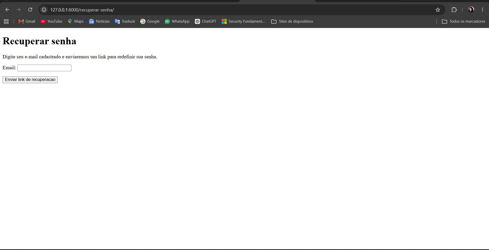
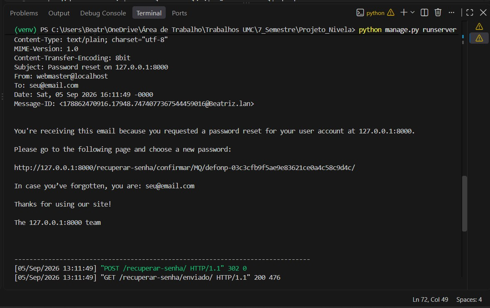
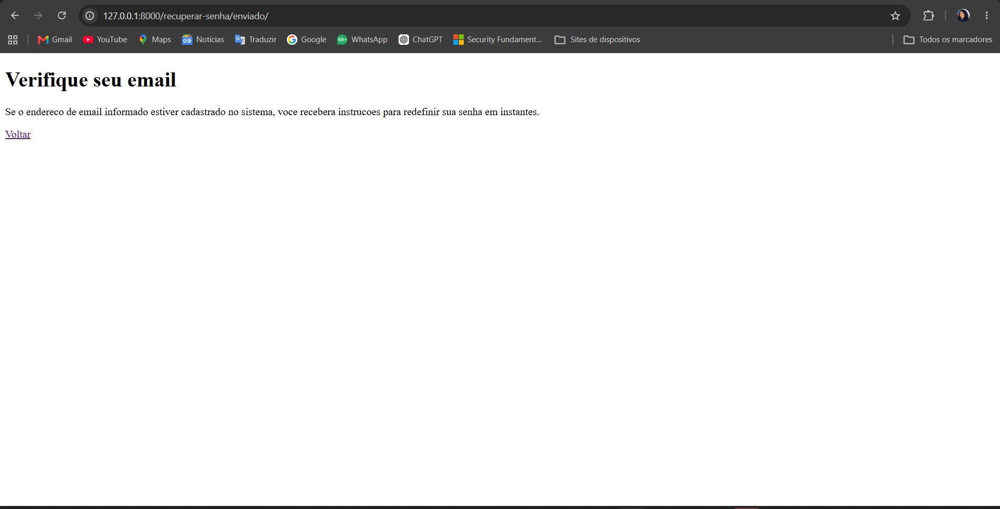
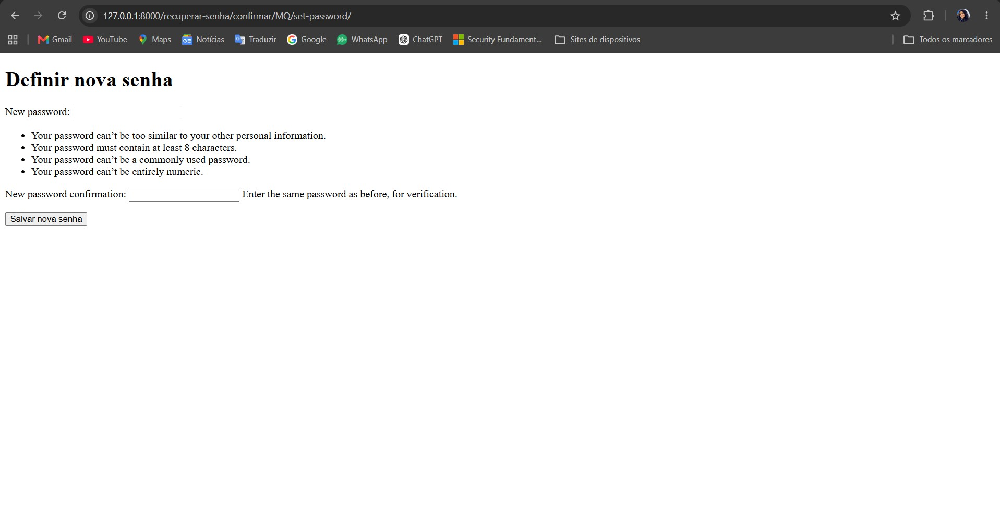
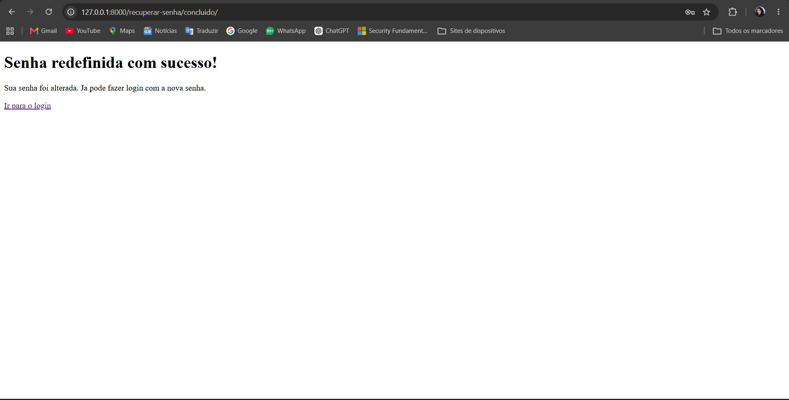
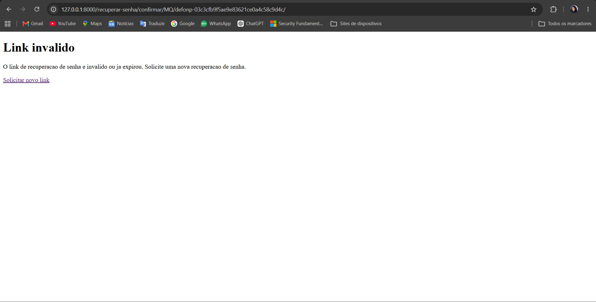
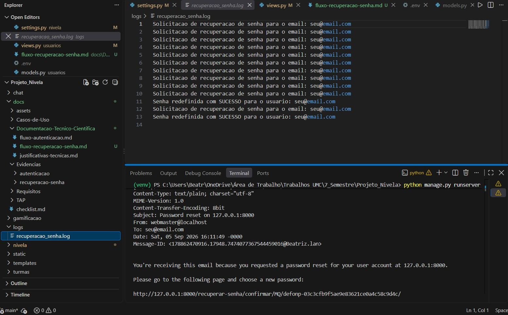

# Fluxo de Recuperação de Senha — Requisito 2

## Visão geral

O sistema permite que um usuário redefina sua senha caso a tenha esquecido,
através de um link de recuperação enviado por email. A implementação utiliza
as views nativas de recuperação de senha do Django (`django.contrib.auth`),
estendidas para registrar em log as solicitações e o resultado do processo.

## Fluxo passo a passo

1. O usuário acessa `/recuperar-senha/` e informa seu email cadastrado.
2. O sistema gera um token seguro associado àquele usuário e envia um email
   contendo um link único de redefinição de senha (item 2.1).
3. Por segurança, a tela seguinte (`/recuperar-senha/enviado/`) exibe sempre
   a mesma mensagem genérica, independente de o email existir ou não no banco,
   evitando que a funcionalidade seja usada para descobrir quais emails estão
   cadastrados no sistema.
4. Ao clicar no link recebido, o usuário é direcionado à tela de definição de
   nova senha, desde que o token seja válido.
5. Após informar e confirmar a nova senha, o sistema a salva e exibe a tela
   de confirmação (`/recuperar-senha/concluido/`).

Abaixo, evidências do fluxo completo em funcionamento:

## Geração e segurança do token (item 2.2)

O token é gerado pelo `PasswordResetTokenGenerator` nativo do Django, que
utiliza um hash HMAC baseado em SHA-256, combinando: o ID do usuário, a data
do último login, um timestamp e a `SECRET_KEY` do projeto. Isso torna o token
impossível de ser adivinhado ou gerado por terceiros sem acesso ao servidor.

## Expiração do token (item 2.3)

O tempo de validade do token é controlado pela configuração
`PASSWORD_RESET_TIMEOUT`, definida em `settings.py` como **3600 segundos
(1 hora)**. O valor padrão do Django é de 3 dias (259200 segundos); optamos
por reduzir esse tempo para diminuir a janela de uso de um link comprometido
ou esquecido em algum lugar (ex.: caixa de entrada de email compartilhada).

## Invalidação após uso e tratamento de token inválido (itens 2.4 e 2.5)

O próprio mecanismo de geração do token do Django faz com que o hash mude
assim que a senha do usuário é alterada — ou seja, um token usado uma vez
deixa de ser válido para usos futuros automaticamente, sem necessidade de
lógica adicional.

No template `password_reset_confirm.html`, a variável de contexto
`validlink` (calculada pela `PasswordResetConfirmView` do Django antes de
renderizar a página) indica se o token na URL ainda é válido. Quando
`validlink` é `False` (token expirado, já utilizado, ou inválido), o sistema
exibe uma mensagem de erro ("Link inválido") ao invés do formulário de nova
senha, e oferece um link para solicitar uma nova recuperação.

Evidência do sistema tratando corretamente a tentativa de reutilizar um token já usado:

## Registro em log (itens 2.6 e 2.7)

Foram criadas duas views customizadas em `usuarios/views.py`, que estendem
as views nativas do Django e adicionam chamadas a um logger próprio
(`usuarios.recuperacao_senha`, configurado em `settings.py` na seção
`LOGGING`, gravando no arquivo `logs/recuperacao_senha.log`):

- **`RecuperarSenhaView`**: registra em log toda solicitação de recuperação
  de senha, com o email informado (item 2.6).
- **`RedefinirSenhaView`**: registra em log o sucesso (`INFO`) ou a falha
  (`WARNING`) da tentativa de redefinição de senha, com o usuário afetado
  (item 2.7).

Evidência dos registros gravados no arquivo de log:

## Configuração de envio de email

Em ambiente de desenvolvimento, o envio de email utiliza o
`django.core.mail.backends.console.EmailBackend`, que imprime o conteúdo do
email no console em vez de enviá-lo de fato — permitindo testar todo o
fluxo sem depender de um servidor de email real. Em produção, este backend
deverá ser substituído por um backend SMTP real.