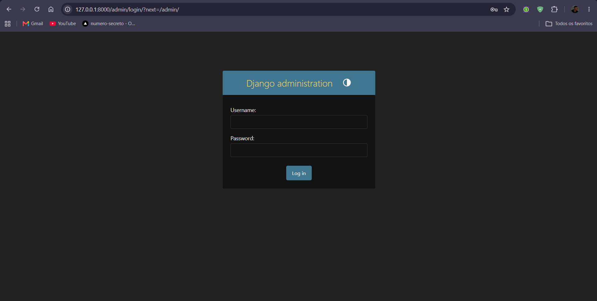
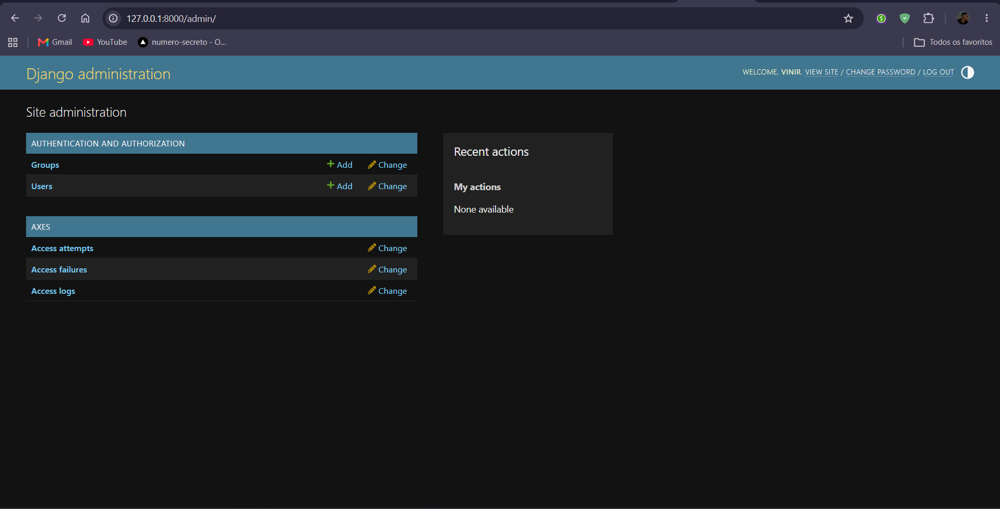
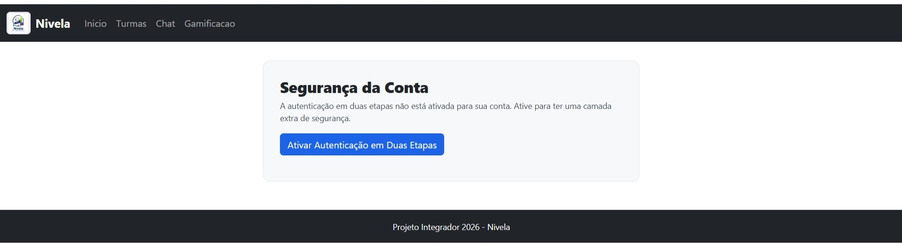
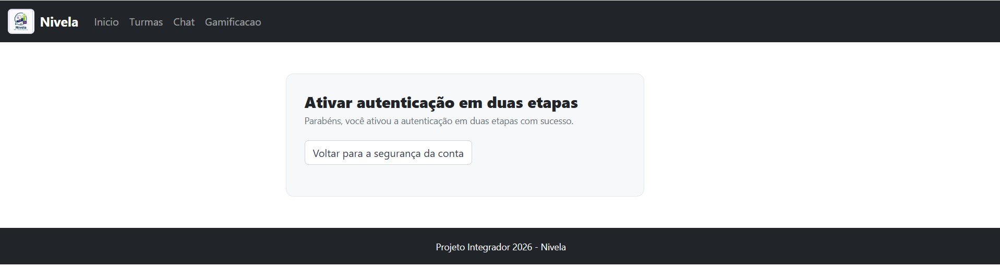
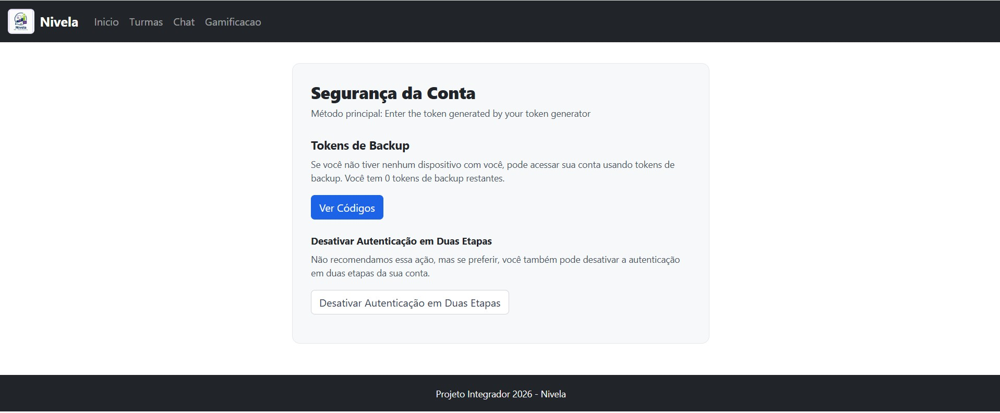
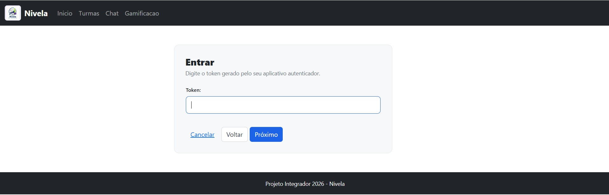
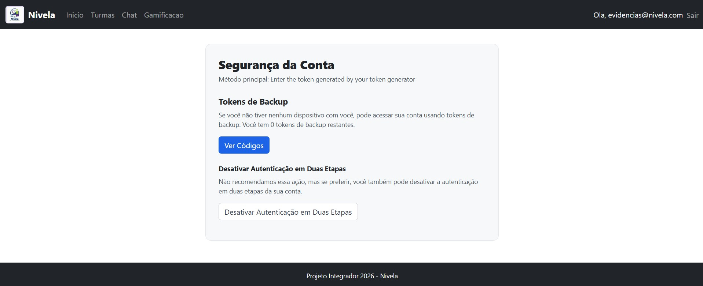
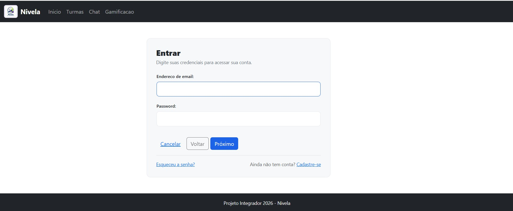
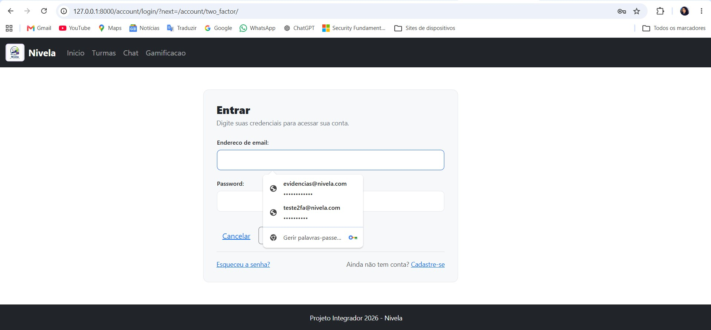
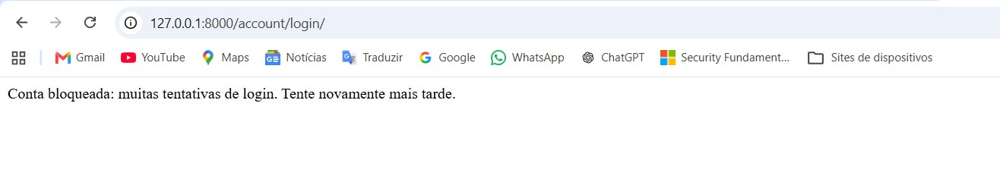

# Evidências - Autenticação (Requisito 1)

Todos os testes abaixo foram feitos em ambiente local (http://127.0.0.1:8000),
com usuários de teste criados só para este fim.

## Mapa das evidências por item do checklist

| Item | O que comprova | Evidência |
|------|----------------|-----------|
| 1.1 a 1.4 | Hash com PBKDF2 e salt por usuário | Pasta `docs/Evidencias/criptografia-hash-senha/` |
| 1.5 | 2FA implementado e ativado | print-2fa-antes-de-ativar.jpg, print-2fa-ativado.jpg, print-2fa-perfil-ativo.jpg |
| 1.6 | 2FA validado depois da senha | print-2fa-token.jpg, print-2fa-login-concluido.jpg |
| 1.7 | Fluxo documentado | `docs/Documentacao-Tecnico-Cientifica/fluxo-autenticacao.md` |
| 1.8 | Evidências funcionais | Prints desta pasta, descritos neste README |
| 1.9 | Sessão com expiração de 30 minutos | print-sessao-expiracao-banco.png e `SESSION_COOKIE_AGE = 1800` em `nivela/settings.py` |
| 1.10 | Sessão invalidada no logout | print-logout.jpg, print-logout-sessao-invalidada.jpg |
| 1.11 | Bloqueio por força bruta | print-bloqueio-axes.jpg |
| 1.12 | Justificativas técnicas | `docs/Documentacao-Tecnico-Cientifica/justificativas-tecnicas.md` |

## Teste de login no admin do Django

Testamos o acesso ao painel administrativo (/admin/) usando um superusuário
criado localmente com o comando createsuperuser.

Como foi feito o teste:
1. Subimos o servidor local com o comando runserver.
2. Acessamos http://127.0.0.1:8000/admin/login/ pelo navegador.
3. Fizemos login com o usuário e senha criados.

Resultado: o login funcionou normalmente. Depois de entrar, o painel
mostrou as opções padrão do Django (Users, Groups) e também as do
django-axes (Access attempts, Access failures, Access logs), que é a
proteção contra tentativas de força bruta que o projeto usa. Isso mostra
que o login e essa proteção estão funcionando juntos.

Stack usada no teste: Django 5.2 + PostgreSQL (porta 5433) + django-axes.

Tela de login antes de entrar com o usuário.

Painel depois do login, mostrando os módulos de autenticação e do axes.

## Autenticação em duas etapas (2FA) - itens 1.5 e 1.6

Testamos o 2FA com um usuário de teste, cadastrado pela tela de cadastro
(/cadastro/) e usando um aplicativo autenticador no celular (TOTP).

Como foi feito o teste:
1. Cadastramos o usuário de teste e entramos com e-mail e senha.
2. Na página Segurança da Conta, o 2FA ainda estava desativado.
3. Ativamos o 2FA pelo assistente e confirmamos com o código do aplicativo.
4. Saímos e entramos de novo: depois do e-mail e da senha, o site passou a
   exigir o código de 6 dígitos.

Página Segurança da Conta antes de ativar o 2FA.

Confirmação de que a autenticação em duas etapas foi ativada.

Página Segurança da Conta com o 2FA ativo.

Segundo passo do login: o site pede o código do aplicativo depois da senha.

Login concluído depois de informar o código de 6 dígitos.

## Expiração de sessão - item 1.9

A expiração da sessão é controlada por três configurações em `nivela/settings.py`:

- `SESSION_COOKIE_AGE = 1800`: a sessão expira 30 minutos depois da última ação.
- `SESSION_SAVE_EVERY_REQUEST = True`: cada ação do usuário renova esse prazo.
- `SESSION_EXPIRE_AT_BROWSER_CLOSE = True`: a sessão também termina quando o
  navegador é fechado. Por isso o cookie `sessionid` aparece como "Session" no
  DevTools, sem data de validade no navegador. O prazo de 30 minutos fica
  registrado no servidor, na tabela de sessões do banco.

Como foi feito o teste: com o usuário de teste logado, consultamos a data de
expiração da sessão mais recente no banco e comparamos com a hora atual.
O resultado mostrou cerca de 26 minutos restantes, porque a última ação tinha
sido feita cerca de 3 minutos antes da consulta. Os horários estão em UTC.

Consulta ao banco mostrando a data de expiração da sessão, cerca de 30 minutos
depois da última ação.

## Logout e invalidação de sessão - item 1.10

Como foi feito o teste:
1. Logados, clicamos em Sair no menu.
2. O site levou para a tela de login do Nivela.
3. Tentamos abrir a página de segurança da conta pela barra de endereço.
   O site voltou para o login, com o parâmetro `?next=` na URL, o que mostra
   que a sessão não existe mais.

Tela de login logo depois de clicar em Sair.

Acesso a uma página protegida depois do logout: o site redireciona para o login.

## Proteção contra força bruta - item 1.11

O django-axes bloqueia o acesso depois de 5 tentativas erradas
(`AXES_FAILURE_LIMIT = 5`), por usuário e por IP, durante 1 hora
(`AXES_COOLOFF_TIME = 1`). Testamos com um e-mail que não existe,
errando a senha várias vezes seguidas.

Tela exibida quando o limite de tentativas foi excedido.