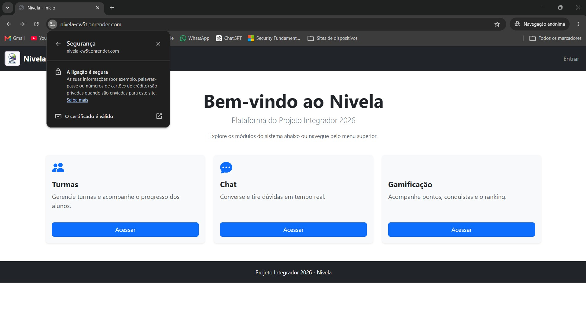
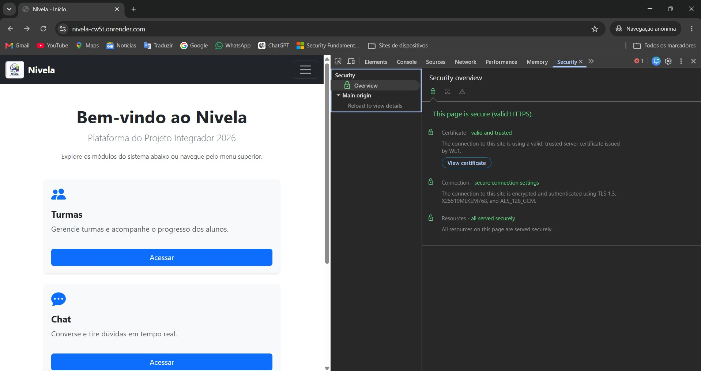
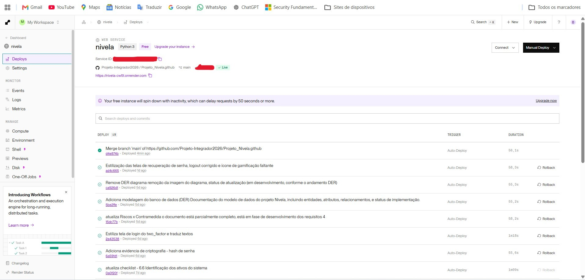
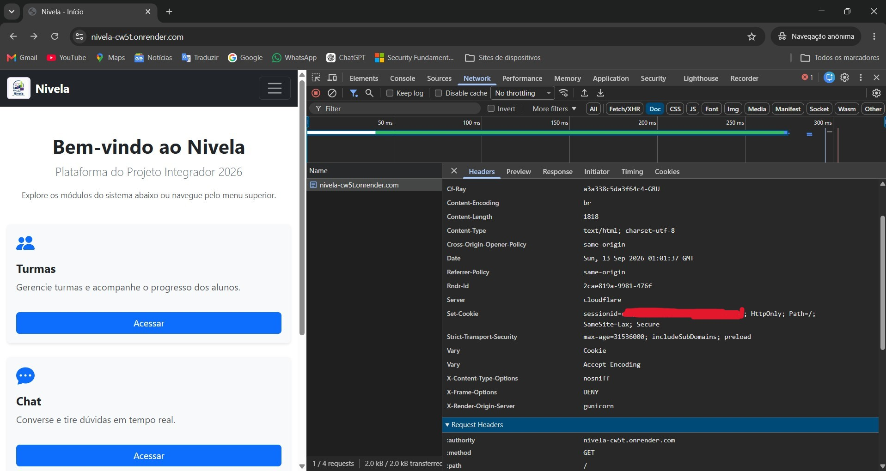
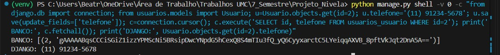

# Evidências - Criptografia e Comunicação Segura (Requisito 3)

## Mapa das evidências por item do checklist

| Item | O que comprova | Evidência |
|------|----------------|-----------|
| 3.1 | Comunicação protegida por TLS/HTTPS | https_certificado-de-pagina-segura.jpg, render-deploy-live.jpg |
| 3.2 | Bloqueio de conexões não seguras | protc-contra-downgrade-para-HTTP.jpg, curl-http-redirect.txt |
| 3.3 | Evidência de tráfego cifrado | evidencia-tls-security-overview.jpg, curl-https-headers.txt |
| 3.4 | Dados sensíveis criptografados em repouso | evidencia-criptografia-em-repouso.jpg |
| 3.5 | Algoritmo criptográfico adequado | evidencia-criptografia-em-repouso.jpg e `usuarios/models.py` |
| 3.6 | Chaves criptográficas protegidas | `nivela/settings.py` (variável de ambiente) |
| 3.7 e 3.8 | Estratégia e justificativa documentadas | `docs/Documentacao-Tecnico-Cientifica/criptografia.md` |

## Comunicação segura (TLS/HTTPS) - itens 3.1 a 3.3

O site publicado no Render (https://nivela-cw5t.onrender.com) é servido por HTTPS.

O navegador indica que a ligação é segura e que o certificado é válido.

Painel Security do navegador: página segura (HTTPS válido), certificado válido
e confiável, e conexão cifrada com TLS 1.3 e AES_128_GCM.

Web Service `nivela` publicado no Render, com status Live.

### Bloqueio de conexões não seguras (item 3.2)

Ao acessar o endereço `http://`, o site responde com `301 Moved Permanently`
e envia o usuário para a versão `https://` (cabeçalho `Location`). A resposta
HTTP é devolvida pela camada de borda da hospedagem (`Server: cloudflare`).
No Django, `SECURE_SSL_REDIRECT` também fica ativo em produção, como segunda
camada de proteção.

Arquivo: `curl-http-redirect.txt`, gerado com:

    curl.exe -sI http://nivela-cw5t.onrender.com

Aba Network do navegador com os cabeçalhos da resposta do site. O cabeçalho
`Strict-Transport-Security` (HSTS, `max-age=31536000; includeSubDomains; preload`)
instrui o navegador a usar sempre HTTPS neste domínio, o que impede o retorno
para HTTP (downgrade). O cookie de sessão também é enviado com as marcas
`Secure` e `HttpOnly`. O valor do cookie foi ocultado.

### Cabeçalhos da resposta HTTPS (item 3.3)

Arquivo: `curl-https-headers.txt`, gerado com:

    curl.exe -sI https://nivela-cw5t.onrender.com

A resposta HTTPS traz o cabeçalho `strict-transport-security` com
`max-age=31536000; includeSubDomains; preload` (HSTS de 1 ano), configurado
em `nivela/settings.py`. Ele instrui o navegador a usar sempre HTTPS
neste domínio. A resposta também traz `x-frame-options: DENY` e
`x-content-type-options: nosniff`.

## Criptografia em repouso - itens 3.4 a 3.6

O telefone do usuário é o dado sensível protegido em repouso. O campo
`TelefoneCriptografadoField` (em `usuarios/models.py`) criptografa o valor
antes de gravar no PostgreSQL e descriptografa ao ler.

- **Algoritmo (item 3.5):** Fernet, da biblioteca `cryptography`
  (AES-128-CBC com autenticação HMAC-SHA256).
- **Chave (item 3.6):** `FIELD_ENCRYPTION_KEY`, uma chave separada da
  `SECRET_KEY`. Ela é lida de variável de ambiente (`config('FIELD_ENCRYPTION_KEY')`
  em `nivela/settings.py`) e não está no código-fonte nem no repositório.
  No Render, ela está configurada nas variáveis de ambiente do serviço.

### Como foi feito o teste (item 3.4)

Em ambiente local, gravamos um telefone fictício em um usuário de teste e
consultamos o banco diretamente, sem passar pela descriptografia do Django, e
depois lemos o mesmo valor pelo Django:

- `BANCO:` mostra um texto cifrado começando por `gAAAAA`, que é o formato do Fernet.
- `DJANGO:` mostra o telefone original, já descriptografado.

Valor cifrado no banco (`BANCO:`) e valor lido pelo Django (`DJANGO:`).