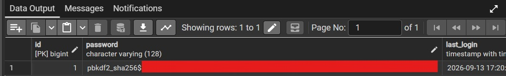

# Teste de Criptografia - Armazenamento de Senhas

## O que foi testado

O Django usa por padrão o algoritmo PBKDF2 com SHA256 para criptografar as senhas dos usuários antes de salvar no banco. Isso significa que a senha digitada no cadastro nunca fica salva como texto puro na tabela usuarios_usuario.

## Como foi verificado

Após criar um usuário de teste, foi feita uma consulta direto na tabela usuarios_usuario pelo pgAdmin, olhando o conteúdo da coluna password.

## Evidência

Como mostra o print, o valor salvo começa com pbkdf2_sha256$, seguido de um hash longo e sem nenhuma relação com a senha original digitada. Isso confirma que o Django está criptografando as senhas corretamente antes de gravar no banco.

## Conclusão

O requisito de armazenamento seguro de senhas foi atendido. A senha real do usuário não fica exposta em nenhum momento no banco de dados.